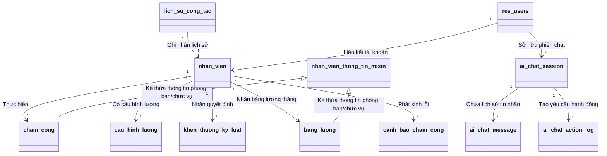

# Báo Cáo Dự Án: Hệ Thống Chấm Công & Tính Lương Tích Hợp Odoo

---

## I. TỔNG QUAN DỰ ÁN

### 1. Mục tiêu dự án
Dự án nhằm xây dựng module **Chấm công và Tính lương** (`cham_cong_tinh_luong`) kết hợp với **AI Chatbot Nhân sự** (`cham_cong_ai_chatbot`) chạy trên nền tảng Odoo 15. Hệ thống giúp doanh nghiệp tự động hóa toàn bộ quy trình từ quản lý thời gian làm việc hàng ngày của nhân viên, phân tích sai sót chấm công, thiết lập chế độ lương, tự động tính toán lương tháng, phân phối phiếu lương qua email, và đặc biệt là tích hợp **Trợ lý AI thông minh** để nhân viên và quản lý có thể truy vấn dữ liệu hoặc tạo các yêu cầu chấm công/nghỉ phép bằng ngôn ngữ tự nhiên.

### 2. Phạm vi tích hợp & Mức độ hoàn thiện
Dự án được phát triển kế thừa có chọn lọc và liên kết chặt chẽ với hệ thống Quản lý nhân sự (`nhan_su`) sẵn có của Khoa, đảm bảo đáp ứng đầy đủ cả 3 cấp độ đánh giá theo tiêu chí môn học:
*   **Mức 1 (Cơ bản - Tích hợp dữ liệu)**: Liên kết dữ liệu HRM (`nhan_vien`) làm gốc. Các module Chấm công và Tính lương kế thừa trực tiếp hồ sơ nhân viên thông qua quan hệ `Many2one`, loại bỏ hoàn toàn việc nhập dữ liệu thủ công.
*   **Mức 2 (Nâng cao - Tự động hóa quy trình)**: Tự động hóa luồng nghiệp vụ từ HRM ➔ Chấm công ➔ Tính lương qua các trigger/sự kiện: tự động phân tích tạo cảnh báo vi phạm chấm công hàng loạt, tự động sinh bảng lương từ dữ liệu chấm công đã xác nhận, và tự động gửi email đính kèm PDF phiếu lương cho nhân viên khi kế toán xác nhận thanh toán.
*   **Mức 3 (Xuất sắc - Ứng dụng AI thực tế)**: Tích hợp module **AI Chatbot** (`cham_cong_ai_chatbot`) kết nối trực tiếp với OpenAI API thông qua kỹ thuật **Function Calling** và cơ chế **Action Confirmation** (Xác nhận hành động an toàn trước khi thay đổi cơ sở dữ liệu), cho phép tạo/sửa chấm công, xin nghỉ phép, tra cứu lương bằng hội thoại tiếng Việt.

---

## II. KIẾN TRÚC HỆ THỐNG & LIÊN KẾT MÔ HÌNH DỮ LIỆU (ERD)

Hệ thống được thiết kế theo mô hình MVC của Odoo và cấu trúc cơ sở dữ liệu tích hợp:

### Chi tiết các thực thể dữ liệu (Models)

1.  **Nhân viên Thông tin Mixin ([nhan_vien_thong_tin.mixin](file:///d:/My_Lan/HN-QTDN-17-04-N2/addons/cham_cong_tinh_luong/models/nhan_vien_thong_tin_mixin.py))**:
    *   *Mục đích*: Lớp trừu tượng (AbstractModel) giúp tự động tính toán phòng ban (`phong_ban_id`) và chức vụ (`chuc_vu_id`) tại thời điểm chấm công hoặc tính lương dựa trên tệp lịch sử công tác gần nhất của nhân viên trong HRM.
2.  **Chấm công ([cham_cong](file:///d:/My_Lan/HN-QTDN-17-04-N2/addons/cham_cong_tinh_luong/models/cham_cong.py))**:
    *   *Các trường chính*: Nhân viên (`nhan_vien_id`), ngày chấm công, ca làm việc (hành chính, sáng, chiều, tối), giờ vào (UTC), giờ ra (UTC), trạng thái (đi làm, nửa ngày, đi muộn, nghỉ, tăng ca), số ngày công quy đổi, số giờ làm, số giờ tăng ca.
3.  **Cấu hình lương ([cau_hinh_luong](file:///d:/My_Lan/HN-QTDN-17-04-N2/addons/cham_cong_tinh_luong/models/cau_hinh_luong.py))**:
    *   *Các trường chính*: Nhân viên, lương cơ bản, ngày công chuẩn (mặc định 26), số giờ công chuẩn (mặc định 8), các khoản phụ cấp (ăn trưa, xăng xe, trách nhiệm, khác), tỷ lệ đóng bảo hiểm (%), thuế TNCN, khấu trừ khác.
4.  **Bảng lương tháng ([bang_luong](file:///d:/My_Lan/HN-QTDN-17-04-N2/addons/cham_cong_tinh_luong/models/bang_luong.py))**:
    *   *Các trường chính*: Tổng ngày công thực tế, tổng giờ làm, tổng giờ tăng ca, lương theo ngày công, tiền tăng ca, tổng phụ cấp, khen thưởng, kỷ luật, tiền đóng bảo hiểm, thuế TNCN, tổng khấu trừ, thực lĩnh.
5.  **Cảnh báo chấm công ([canh_bao_cham_cong](file:///d:/My_Lan/HN-QTDN-17-04-N2/addons/cham_cong_tinh_luong/models/canh_bao_cham_cong.py))**:
    *   *Mục đích*: Lưu trữ các vi phạm chấm công (đi muộn, về sớm, thiếu giờ ra, làm quá giờ...) sau khi chạy phân tích để phục vụ quản lý nhân sự.
6.  **Phiên chat AI ([ai.chat.session](file:///d:/My_Lan/HN-QTDN-17-04-N2/addons/cham_cong_ai_chatbot/models/ai_chat_session.py)) & Tin nhắn ([ai.chat.message](file:///d:/My_Lan/HN-QTDN-17-04-N2/addons/cham_cong_ai_chatbot/models/ai_chat_message.py))**:
    *   *Mục đích*: Lưu trữ ngữ cảnh hội thoại của từng người dùng để duy trì mạch chat với Trợ lý AI.
7.  **Nhật ký hành động chat AI ([ai.chat.action.log](file:///d:/My_Lan/HN-QTDN-17-04-N2/addons/cham_cong_ai_chatbot/models/ai_chat_action_log.py))**:
    *   *Mục đích*: Lưu trữ các tham số yêu cầu hành động (ví dụ: tạo chấm công, xin nghỉ phép) ở trạng thái chờ xác nhận (`pending_confirm`) và ghi vết kết quả sau khi người dùng bấm đồng ý/hủy bỏ trên giao diện.

---

## III. CÁC TÍNH NĂNG NỔI BẬT ĐÃ TRIỂN KHAI

### 1. Quản lý thời gian làm việc & Tăng ca linh hoạt theo ca (Mức 1)
*   Hỗ trợ khai báo ca làm việc đa dạng. Tự động tính toán số giờ làm việc thực tế và số giờ tăng ca vượt định mức chuẩn của từng ca (ca tối công chuẩn là 4.0 giờ, ca hành chính công chuẩn 8.0 giờ).
*   Định vị và chuẩn hóa múi giờ check-in/out tự động theo múi giờ Việt Nam (`Asia/Ho_Chi_Minh`) khi lưu vào cơ sở dữ liệu UTC của Odoo.

### 2. Tự động hóa tính toán Thu nhập & Thực lĩnh (Mức 2)
*   **Lương ngày công**: Tính tỷ lệ thực tế dựa trên số ngày công chuẩn trong cấu hình riêng của từng nhân viên thay vì gán cứng con số 26 ngày.
*   **Tiền tăng ca**: Đơn giá giờ làm việc chuẩn được nhân với Hệ số tăng ca (mặc định 1.5x hoặc tùy chỉnh trên bảng lương) và nhân với tổng giờ tăng ca tích lũy của các ngày chấm công đã xác nhận trong tháng.
*   **Công thức chuẩn**:
    *   `Tổng lương = Lương ngày công + Tổng phụ cấp + Tiền tăng ca + Khen thưởng`
    *   `Khấu trừ = Lương cơ bản * Tỷ lệ bảo hiểm + Thuế TNCN + Khấu trừ khác`
    *   `Thực lĩnh = Tổng lương - Khấu trừ - Kỷ luật`

### 3. Tự động hóa gửi Phiếu lương qua Email & Chatter (Mức 2)
*   Hệ thống tích hợp nút bấm **Gửi Email** thủ công và đặc biệt là cơ chế trigger tự động. Khi bảng lương được Kế toán chuyển sang trạng thái "Đã thanh toán" (`da_thanh_toan`), Odoo sẽ tự động:
    1.  Sinh file PDF phiếu lương chi tiết từ báo cáo hệ thống.
    2.  Gọi Email Template HTML tiếng Việt chuyên nghiệp được định cấu hình sẵn.
    3.  Gửi email kèm file PDF phiếu lương trực tiếp đến hòm thư của nhân viên (lấy từ HRM).
    4.  Ghi vết nhật ký gửi thư thành công vào Chatter của bản ghi để theo dõi.

### 4. Tự động phân tích tạo Cảnh báo vi phạm (Mức 2)
*   Tích hợp wizard **Phân tích chấm công** tự động quét dữ liệu chấm công hàng tháng của toàn bộ nhân viên để phát hiện lỗi:
    *   *Đi muộn nhiều*: Đi muộn $\ge 3$ lần trong tháng.
    *   *Thiếu ngày công*: Tổng ngày đi làm $< 20$ ngày.
    *   *Tăng ca quá mức*: Tổng giờ làm thêm $> 30$ giờ/tháng (cảnh báo sức khỏe lao động).
    *   *Lỗi dữ liệu*: Quên check-in hoặc check-out (thiếu giờ vào/ra).

### 5. Hệ thống AI Chatbot Nhân sự thông minh (Mức 3)
*   Cung cấp một Client Action (giao diện chat widget) ngay trong Odoo, cho phép nhân viên và quản trị viên giao tiếp với Trợ lý AI bằng tiếng Việt.
*   **Cơ chế OpenAI Function Calling**: Chatbot tự động phát hiện ý định của người dùng và gọi các hàm nghiệp vụ Odoo tương ứng:
    *   `get_attendance_days`: Tra cứu ngày công và tổng giờ làm.
    *   `get_overtime_hours`: Tra cứu tổng giờ tăng ca.
    *   `get_salary_monthly`: Tra cứu chi tiết tổng lương, thuế, bảo hiểm và thực nhận.
    *   `get_attendance_alerts`: Tra cứu danh sách lỗi chấm công cá nhân.
*   **Cơ chế Action Confirmation (Bảo mật & Kiểm soát)**: Đối với các thao tác thay đổi dữ liệu như **Tạo chấm công**, **Cập nhật giờ vào/ra**, hoặc **Xin nghỉ phép**, AI Chatbot không tự ý ghi đè cơ sở dữ liệu. Nó sẽ tạo bản ghi log ở trạng thái `pending_confirm` và hiển thị một hộp thoại xác nhận trực quan: *"Tôi hiểu bạn muốn cập nhật chấm công ngày DD/MM/YYYY. Bạn có muốn xác nhận không?"*. Thao tác chỉ thực thi khi người dùng click nút "Xác nhận" (Confirm) trên giao diện.

---

## IV. PHÂN QUYỀN & BẢO MẬT HỆ THỐNG

Phân quyền được phân cấp chi tiết qua model access (`ir.model.access.csv`) và bộ quy tắc bản ghi (`rules.xml`):

| Vai trò | Phạm vi hiển thị & Quyền hạn |
| :--- | :--- |
| **Nhân viên (Self-service)** | Chỉ được quyền Xem và Sửa thông tin Chấm công của chính mình; Xem Phiếu lương và Cảnh báo cá nhân của mình. Chỉ được sử dụng Chatbot AI với phạm vi bản thân (`employee_scope='self'`). |
| **Nhân sự (HR)** | Xem và quản lý toàn bộ dữ liệu Chấm công, Cấu hình lương, Khen thưởng/Kỷ luật và Cảnh báo của toàn công ty. Được quyền tra cứu thông tin nhân viên khác qua Chatbot. |
| **Kế toán (Accountant)** | Xem toàn bộ Chấm công; Xem và thực hiện tính toán bảng lương chi tiết, xác nhận và duyệt thanh toán lương của toàn công ty. |
| **Quản trị viên (Manager)** | Toàn quyền kiểm soát hệ thống, bao gồm quyền Xóa bản ghi và cấu hình phân quyền người dùng. Đồng thời, có quyền quản trị và xem logs hoạt động của AI Chatbot. |

*   **Tự động đồng bộ nhóm quyền Chatbot**: Hệ thống override phương thức `create`, `write`, và `_register_hook` của `res.users` để tự động kiểm tra và phân nhóm quyền sử dụng Chatbot (`group_ai_chatbot_employee_user` hoặc `group_ai_chatbot_manager`) tương ứng với vai trò của người dùng trong hệ thống nhân sự, ngăn chặn tuyệt đối việc nhân viên thông thường tra cứu lương của nhân viên khác hoặc Admin.

---

## V. TỐI ƯU HÓA HIỆU NĂNG (PERFORMANCE OPTIMIZATION)

Dự án đã thực hiện cải tiến hiệu năng sâu cho cơ sở dữ liệu để đáp ứng quy mô nhân sự lớn:
1.  **Batch Pre-fetching (Tránh lỗi N+1 Query)**: Khi sinh bảng lương hàng loạt cho toàn công ty, hệ thống chỉ thực hiện đúng 3 câu truy vấn SQL duy nhất để gom toàn bộ cấu hình lương, chấm công và khen thưởng/kỷ luật vào RAM, sau đó phân phối và tính toán bằng cấu trúc dữ liệu Python. Giúp giảm thiểu thời gian thực thi xuống dưới 1 giây đối với quy mô hàng trăm nhân viên.
2.  **Gom nhóm truy vấn Dashboard**: Sử dụng API `read_group` của Odoo để thực hiện các phép tính tổng hợp (`SUM`, `COUNT`) ngay ở tầng cơ sở dữ liệu PostgreSQL thay vì đọc từng bản ghi lên RAM để đếm thủ công, giúp Dashboard tải dữ liệu tức thì.

---

## VI. KIỂM THỬ CHẤT LƯỢNG (TESTING & VERIFICATION)

Bộ test tự động [test_payroll.py](file:///d:/My_Lan/HN-QTDN-17-04-N2/addons/cham_cong_tinh_luong/tests/test_payroll.py) được xây dựng để kiểm tra tính chính xác của nghiệp vụ:
1.  *Test ca làm việc và tăng ca*: Xác minh số giờ làm việc chuẩn và số giờ làm thêm tính ra khớp hoàn toàn với quy định của từng ca.
2.  *Test logic tính toán số tiền*: Giả lập một kỳ lương hoàn chỉnh với ngày công thực tế, giờ tăng ca, các quyết định thưởng phạt, tỷ lệ đóng bảo hiểm và thuế TNCN để đối soát số tiền Thực lĩnh cuối cùng đạt độ chính xác tuyệt đối.
3.  *Test tự động gửi email thông báo*: Xác nhận email được tự động khởi tạo trong hàng đợi gửi đi (`mail.mail`) và hướng tới đúng hòm thư nhân viên khi bảng lương chuyển sang trạng thái đã thanh toán.

---

## VII. ĐÁNH GIÁ KẾT QUẢ & ĐỀ XUẤT PHÁT TRIỂN TIẾP THEO

### 1. Kết quả đạt được
*   Hoàn thành xuất sắc cả 3 mức yêu cầu của Bài tập lớn: Tích hợp 3 module (Mức 1), Tự động hóa luồng nghiệp vụ gửi email phiếu lương & cảnh báo (Mức 2), Tích hợp AI Chatbot với Function Calling & Xác nhận hành động an toàn (Mức 3).
*   Giao diện người dùng được thiết kế hiện đại, đạt chuẩn tương phản tiếp cận người dùng (WCAG AA) và hỗ trợ giảm hiệu ứng chuyển động (Reduced Motion).
*   Hệ thống tối ưu hóa hiệu năng tốt, không phát sinh lỗi N+1 query. Lịch sử commit GitHub minh bạch và đầy đủ kiểm thử tự động.

### 2. Hướng phát triển tiếp theo
*   Mở rộng kết nối trực tiếp với các thiết bị máy chấm công phần cứng (qua giao thức kết nối TCP/IP) để đẩy dữ liệu chấm công trực tiếp về Odoo theo thời gian thực thay vì import qua tệp Excel thủ công (External API).
*   Nâng cấp AI Chatbot tích hợp công nghệ chuyển đổi giọng nói thành văn bản (Speech-to-Text) để nhân viên có thể chấm công hoặc tra cứu lương bằng giọng nói trực tiếp trên thiết bị di động.
